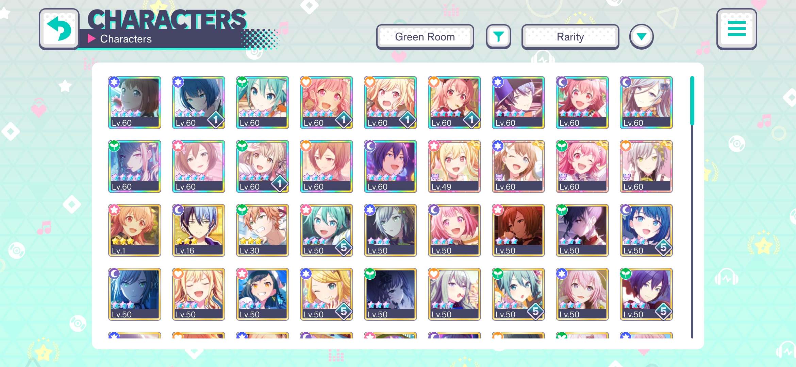
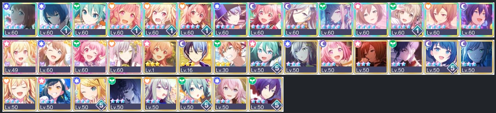

# Project Sekai Thumbnail Extractor

A small tool for extracting Project Sekai card thumbnails from the characters list.

## Usage

[Link to Website Demo](https://ace4896.github.io/project-sekai-thumbnail-extractor/)

First, open a screenshot of the character list as shown below:



The tool will extract the individual card thumbnails, which you can right click to save/view separately:



## Development Usage

The website demo is made using SolidJS, Bootstrap and OpenCV.js, and is managed using NodeJS and Vite.

- Install NodeJS LTS (tested on v20.11.0)
- Run `npm install` to download dependencies
- Use one of the scripts below to use the app:

```bash
# Run app in development mode
$ npm run dev

# Build app in production mode
$ npm run build

# Preview app in production mode (requires building first)
$ npm run serve
```

## Image Processing Details

The main image processing is handled by OpenCV, and can be summarised into two main steps:

- Locate the character box in the screenshot (the white box containing all of the card thumbnails)
  - Threshold the screenshot so that only near-white pixels are retained
  - Find the largest external contour
  - Approximate this contour to a regular polygon
  - Crop to the bounding rect of the approximated contour
- Locate the card thumbnails in the character box
  - Inverse threshold the screenshot so that near-white pixels appear as black, and all others appear as white
  - Find external contours within the character box twice - second pass is needed since the contours are usually disjointed
  - Calculate the bounding boxes for each contour, only retaining ones that are square-ish
  - Crop each card thumbnail from the card box

More details can be found in [this repository](https://github.com/Ace4896/project-sekai-thumbnail-matching-notes), which has various Jupyter Notebooks that use this approach.
